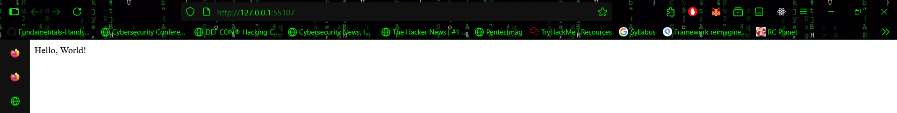
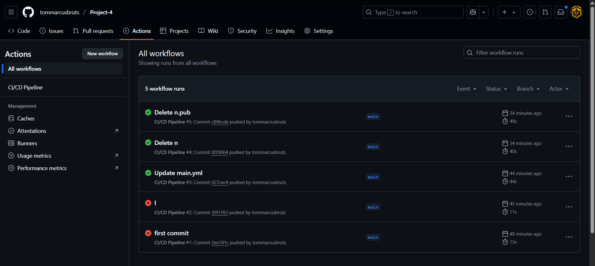
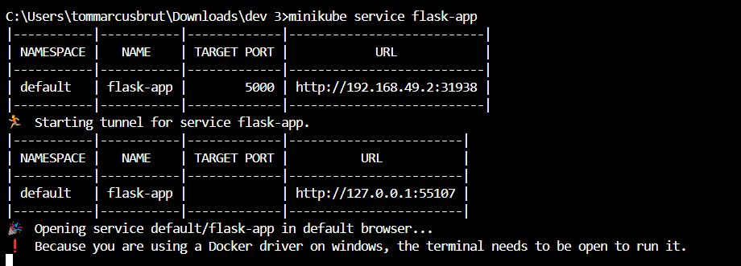
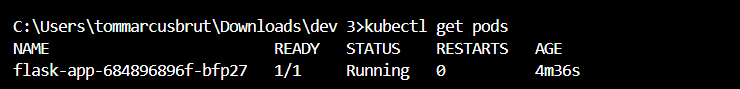

# 🚀 CI/CD Pipeline with GitHub Actions & Docker

## 📝 Introduction
This project demonstrates the implementation of a CI/CD pipeline using GitHub Actions and Docker, with a Flask web application integrated with Prometheus for metrics exposure. The pipeline automates testing, building, and deploying the Docker image.

## 📄 Abstract
The application is a simple Flask app with three endpoints: `/`, `/slow`, and `/metrics`. The `/metrics` endpoint is exposed using the Prometheus client, allowing monitoring of request count and latency.

The CI/CD pipeline is configured using GitHub Actions, which runs on each push to the main branch, executes unit tests, builds the Docker image, and pushes it to Docker Hub. The final image is deployed locally using Docker and Kubernetes via Minikube.

## 🛠️ Tools Used
- 🐍 Python 3.11
- 🌶️ Flask
- 📈 Prometheus Client
- 🐳 Docker & Docker Hub
- ⚙️ GitHub Actions
- ☸️ Kubernetes (Minikube)
- 🗃️ Git

## 🏗️ Steps Involved in Building the Project
1. 🏗️ Created a Flask app with Prometheus metrics for request count and latency.
2. 🧪 Wrote unit tests to validate the Flask endpoints.
3. 📦 Dockerized the application using a custom Dockerfile.
4. 🔄 Configured a GitHub Actions workflow to run tests, build the Docker image, and push it to Docker Hub.
5. 💻 Pulled the image on a local machine and ran it using Docker Desktop.
6. ☸️ Deployed the Docker image to Minikube using `kubectl` commands.
7. ✅ Verified all endpoints and Prometheus metrics working inside the Kubernetes cluster.

## 🖼️ Screenshots
screenshots below to showcase the application, CI/CD workflow, or deployment steps:

| Description                   | Screenshot                                 |
|-------------------------------|--------------------------------------------|
| Flask App Running Locally     |     |
| GitHub Actions Workflow       |  |
| App Deployed on Minikube      |       |
| `kubectl get pods` Output     |      |

## 🏁 Conclusion
This project showcases a fully automated CI/CD pipeline using GitHub Actions and Docker. It successfully demonstrates deployment both on local Docker and a Kubernetes environment using Minikube. This pipeline ensures code quality, reliability, and rapid delivery with continuous integration and deployment.
